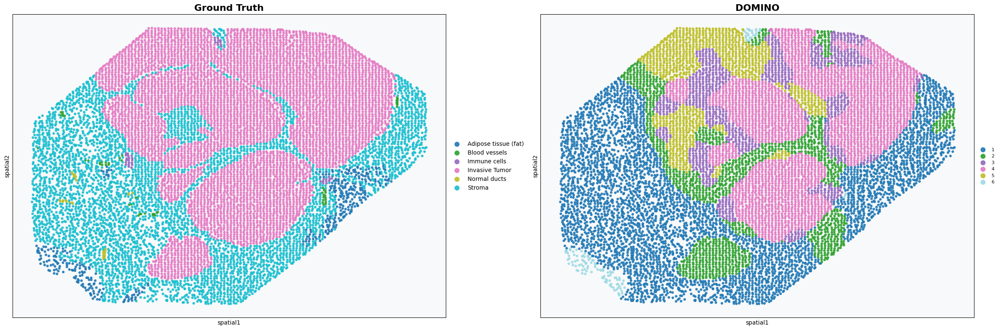

# Tutorial 1: Xenium
In this tutorial, we show how to apply DOMINO to identify spatial domains on Xenium data. As a example,  we choose the slice named *Xenium_BreastCancer.h5ad* to analyse.

Before running the code, please download the input data via https://zenodo.org/records/17890634


## Preparation

<div class="cell-input" data-prompt="1">

```python
import os
import torch
import scanpy as sc
```

</div>


<div class="cell-input" data-prompt="2">

```python
from domino_spatial import DOMINO
```

</div>


<div class="cell-input" data-prompt="3">

```python
device = torch.device('cuda' if torch.cuda.is_available() else 'cpu')
```

</div>


## Reading the data

We expect the input data user provided to be stored in an h5ad file. Within this file, location information should be preserved in adata.obsm[‘spatial’].

<div class="cell-input" data-prompt="4">

```python
# read data
data_root = '.data/'
file_name = 'spe_xenium2.h5ad'
input_file = os.path.join(data_root, file_name)

adata = sc.read_h5ad(input_file)
adata.var_names_make_unique()
```

</div>

<div class="cell-input" data-prompt="5">

```python
adata
```

</div>

<div class="cell-output" data-prompt="5">

```none
AnnData object with n_obs × n_vars = 353783 × 541
    obs: 'sample_id', 'cell_id', 'transcript_id', 'overlaps_nucleus', 'z_location', 'qv', 'region', 'technology', 'total', 'detect', 'sizeFactor', 'cell_type'
    var: 'gene_names'
    uns: 'spatial'
    obsm: 'spatial'
```

</div>

## Training the model

DOMINO model aims to deeply mine the gene expressions and spatial location information by using a self-supervised multi-view graph contrastive learning framework for learning representations.

<div class="cell-input" data-prompt="6">

```python
# define the model
model = DOMINO.DOMINO(adata, device, is_downsample=True, grid_size=120)
```

</div>

<div class="cell-output" data-prompt="6">

```none
Constructing interaction matrix...
Constructing interaction matrix Done!
generating graphs..
```

</div>

<div class="cell-input" data-prompt="7">

```python
# train the model
adata = model.train()
```

</div>

<div class="cell-output" data-prompt="7">

```none
Initializing model..
Begin to train ST data...
100%|███████████████████████████████████████████████████████████████████████████████| 800/800 [00:22<00:00, 36.23it/s]
```

</div>

<div class="cell-input" data-prompt="8">

```python
adata
```

</div>

<div class="cell-output" data-prompt="8">

```none
AnnData object with n_obs × n_vars = 10710 × 541
    obs: 'sample_id', 'cell_id', 'transcript_id', 'overlaps_nucleus', 'z_location', 'qv', 'region', 'technology', 'total', 'detect', 'sizeFactor', 'cell_type', 'grid_id'
    var: 'gene_names', 'highly_variable', 'highly_variable_rank', 'means', 'variances', 'variances_norm'
    uns: 'spatial', 'hvg', 'grid_assignments'
    obsm: 'spatial', 'graph_neigh', 'adj', 'graph_diffusion', 'adj_diffusion', 'label_CSL', 'feat', 'emb'
```

</div>

After running the domino model, the following key sections are added to the adata:

* **adata.obs['highly_variable']**: Identified high-variable genes that are filtered during the data preprocessing stage.
* **adata.obs['graph_neigh']**: Adjacency matrix, used as a mask for pooling operations; ‘graph_diffusion’ represent diffusion graph.
* **adata.obs['adj']**: Symmetric adjacency matrix for neighborhood aggregation; ‘adj_diffusion’ represent diffusion graph.
* **adata.obs['label_CSL']**: A binary label matrix guides the model to distinguish between positive and negative samples.
* **adata.obs['feat']**: Original node features.
* **adata.obs['emb']**: The restructured node features are used for spatial clustering.

## Spatial clustering

After model training, the learned representations will be saved in adata.obsm[‘emb’]. Then we use the mclust tool for spatial clustering.

<div class="cell-input" data-prompt="9">

```python
# clustering
print("Clustering...")
from domino_spatial.cluster import clustering
n_clusters = 6

clustering(adata, radius=50, n_clusters=n_clusters, method='mclust', refinement=True)
```

</div>

<div class="cell-output" data-prompt="9">

```none
Clustering...
R[write to console]:                    __           __ 
   ____ ___  _____/ /_  _______/ /_
  / __ `__ \/ ___/ / / / / ___/ __/
 / / / / / / /__/ / /_/ (__  ) /_  
/_/ /_/ /_/\___/_/\__,_/____/\__/   version 6.1.1
Type 'citation("mclust")' for citing this R package in publications.

[1] 0
fitting ...
  |======================================================================| 100%
refining domain..
running optimal transport...
finished refining...
```

</div>

<div class="cell-input" data-prompt="10">

```python
# add ground_truth
import pandas as pd

df_meta_layer = adata.obs['region']
adata.obs['ground_truth'] = df_meta_layer.values
adata = adata[~pd.isnull(adata.obs['ground_truth'])]
```

</div>

## Visualization

To present the clustering effect of the DOMINO model on this data more clearly, we visually compare the true labels with the clustering labels of DOMINO.

The annotation for the *spe_xenium2*  data is saved in adata.obs['region'].

<div class="cell-input" data-prompt="11">

```python
# plotting spatial clustering result
import matplotlib.pyplot as plt

if 'spatial' in adata.obsm and 'X_spatial' not in adata.obsm:
    adata.obsm['X_spatial'] = adata.obsm['spatial']  

fig, (ax1, ax2) = plt.subplots(1, 2, figsize=(24, 8))  

sc.pl.scatter(
    adata,
    basis='spatial',
    color='ground_truth',
    title='Ground Truth',
    size=80,
    palette='tab10',
    alpha=0.9,
    ax=ax1,
    show=False,
    legend_loc='right margin',
    legend_fontsize=10
)

sc.pl.scatter(
    adata,
    basis='spatial',  
    color='domain',
    title='DOMINO',
    size=80,
    palette='tab20',
    alpha=0.9,
    ax=ax2,
    show=False,
    legend_loc='right margin',
    legend_fontsize=8
)

for ax in [ax1, ax2]:
    ax.set_facecolor('#f8f9fa')
    ax.title.set_size(16)
    ax.title.set_weight('bold')

plt.subplots_adjust(wspace=0.4)  
plt.tight_layout()
plt.show()
```

</div>




